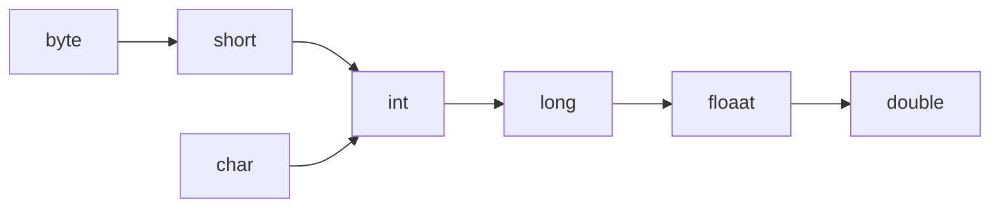
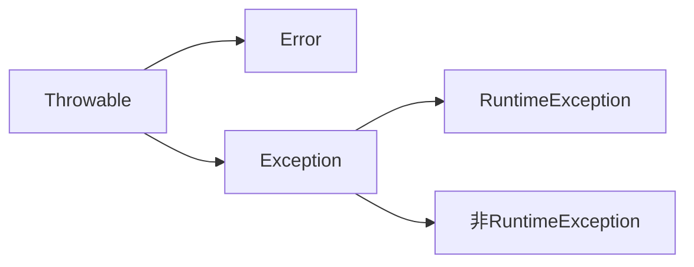
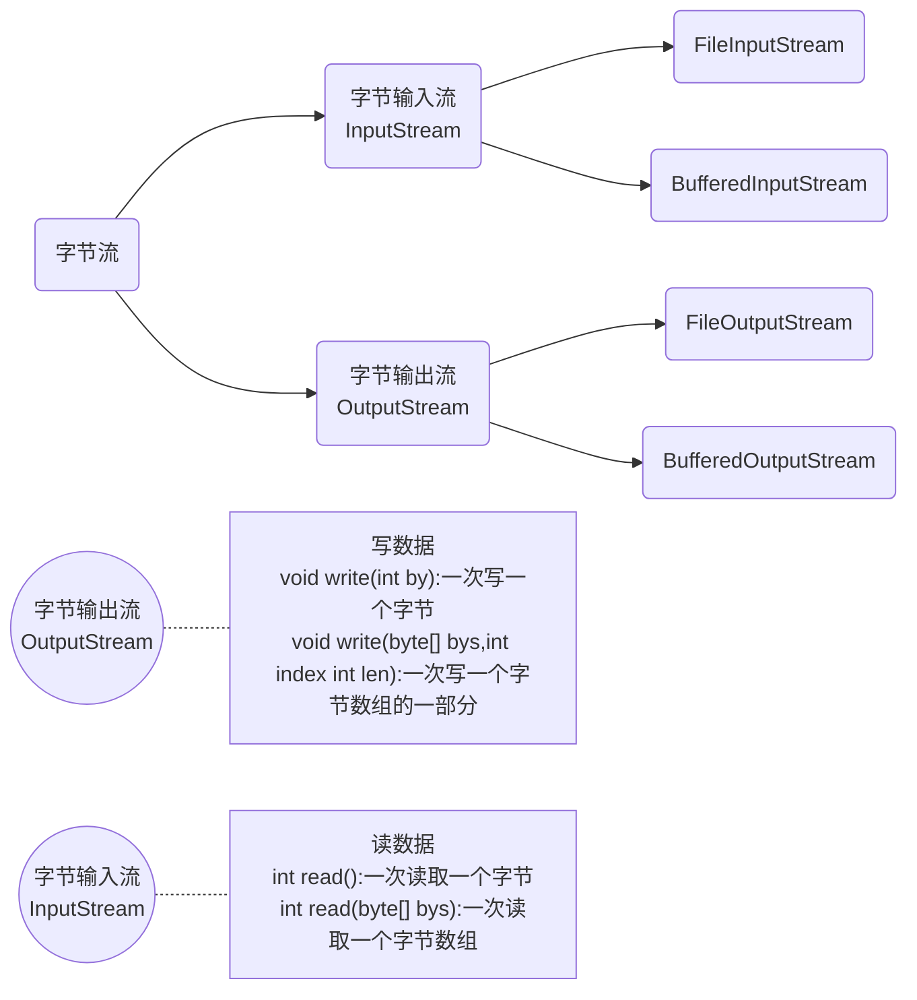
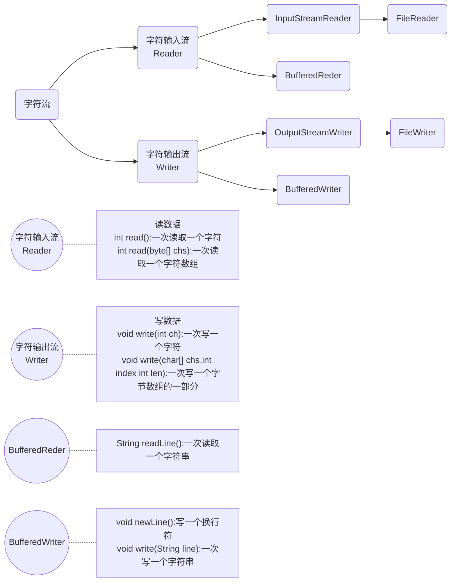

# JavaSE基础

## Java基础语法

### 常量

1. 字符串常量("")

2. 整数常量

3. 字符常量

4. 布尔常量

5. 空常量  <u>空常量无法直接输出</u>

***

### 数据类型

***

### 变量

***

### 标识符

由数字、字母、下划线_、美元符$  组成

不能以数字开头

不能是关键字

区分大小写

#### 小驼峰命名法（方法、变量）

#### 大驼峰命名法（类）

***

### 类型转换

#### 自动类型转换

把一个表示==数据范围小的数值==或者==变量==赋值给另一个==数据表示范围大的变量==

数值型类型转换




#### 强制类型转换

把一个表示数据范围大的数值或者变量赋值给另一个表示数据范围小的变量

```88.88;
int k = (int)88.88;
```


## 运算符

### 运算符和表达式

***

### 字符的“+”操作

1. 'A'->65    A-Z连续
2. 'a'->97    a-z连续
3. '0'->48    0-9连续

算数表达式中包含多个基本数据类型的值的时候，整个算数表达式的类型会自动进行提升

1. byte,short,char类型将被提升到int类型

2. 整个表达式的类型自动提升到表达式中最高等级操作数相同的类型

   ```mermaid
   graph LR
   A[byte,short,char]-->B[int]-->C[long]-->D[float]-->E[double] 
   ```

   ```java
   //false
   char c = 'A';
   int i =10;
   char temp = c+i;
   System.out.println(temp);
   //不兼容的类型: 从int转换到char可能会有损失
   ```

***

### 赋值运算符

扩展的赋值运算符底层隐含了强制类型转换

```java
short s =10;
// s+= 10;  相当于将s(short)强制转换为int
s = (short)(s+10);
System.out.println(s);
```

***

### 自增自减运算符

```java
i++;//先参与运算赋值后自增
++i;//先自增后参与运算赋值
```

***

### 关系运算符

***

### 逻辑运算符

&、| 不会短路，无论真假，左右两边都执行

==短路原则== ：短路逻辑运算符  <u>&&</u>、<u> ||</u>

### 三元运算符

关系表达式？表达式1：表达式2

***

## 数据输入

### Scanner

```java
//导包
import java.util.Scanner;
//创建对象
Scanner example = new Scanner(System.in);
//接收数据
int i = example.nextInt();
```

***

## 分支语句

### if关系语句

```java
if (关系表达式){
    语句体；
}
//--------------------------
if(关系表达式){
    语句体1；
}else{
    语句体2；
}
//---------------------------
if (关系表达式1){
    语句体1；
}else if (关系表达式2){
    语句体2；
}
//...
else{
    语句体n+1;
}
    
```

### switch语句

```java
switch(表达式){
    case 值1:
    case 值1_1:
        语句体1;
        break;
    case 值2:
        语句体2;
        break;
        //.........
    default:
        语句体n+1;
        //break;可选
}
```

## 循环语句

### for循环

```java
for (初始化语句;条件判断语句;条件控制语句){
    循环体语句；
}
```

***

### while循环

```java
while (条件判断语句){
    循环体语句;
    条件判断语句;
}
```

***

### do...while

```java
初始化语句;
do{
    循环体语句;
    条件控制语句;
}while(条件判断语句);
```

***

### 死循环

```java
for(;;){}
while(true){}
do{}while(true);
```

***

### 跳转控制语句

==continue== 跳过某次循环体内容的执行，继续下一次的执行

==break== 结束当前的整个循环

``` System.exit(0)//JVM退出```

***

### Random

```java
import java.util.Random;
Random exmaple = new Random();
int number = example.nextInt(10);//获取数据的范围[0,10)
```

***

## Array

### 定义格式

``` 
//1
int[] arr;
//2
int arr[];
```

***

### 访问

数组在动态初始化时，会为存储空间添加默认值

1. 布尔值： 默认值==false==
2. 引用数据类型：默认值==null==

```java
int[] arr = new int[3];
System.out.println(arr);//[I@10f87f48 输出内存地址

```

数组静态初始化：初始化时指定每个数组元素的初始值，由系统决定数组长度

```java
int [] arr = new int[] {2,3};
int [] arr ={1,2,3};
```


### 内存访问

1. 栈内存：存储局部变量，定义在方法中的变量，使用完毕，立即消失
2. 堆内存：存储new出来的内容（实体，对象），内容都有地址值，使用完毕后，会在垃圾回收器空闲时被收回

空指针异常：访问的数组已经不再指向堆内存的数据，造成空指针异常

null: 空值，引用数据类型的默认值，表示不指向任何有效对象

### 常见操作

获取数组元素数量 

```java 
int l = arr.length;
```

## 方法

```java
public static void example(){
    return;
}
public static boolean example(int i, int j, int k){
    //....
    //return true;
}
example(z, x, ,y);

```

***

### 方法重载

1. 多个方法在同一个类中
2. 多个方法具有相同的方法名
3. 多个方法的参数不相同，类型不容或者数量不同

重载仅对应方法的定义，与方法的调用无关，调用方式参照标准格式

重载仅针对同一个类中方法的名称与参数进行识别，与==返回值无关==

***

### 方法的参数传递

对于引用类型的参数，形式参数的改变，影响实际参数的值

***

```java
System.out.println("example");//输出内容并换行
System.out.print("example");//输出内容不换行
System.out.println();//换行
```

## Debug

***

## 面向对象基础

alt+insert快捷键快速生成构造方法

***

### this

this修饰的变量用于指代成员变量

方法的形参如果与成员变量同名，不带this修饰的变量指的是形参

==this代表所在类的对象引用==

***

### 封装(private)

==封装、继承、多态==时面向对象三大特征。

***

### 构造方法

如果没有定义构造方法，系统将给出一个默认的无参数构造方法

如果定义了构造方法，系统将不再提供默认的构造方法

如果自定义了带参构造方法，还要使用无参数构造方法，就必须再写一个无参数构造方法

无论是否使用，都给出无参数构造方法==(推荐)==

***

## API

API(Application Programming Interface): 应用程序编程接口

Java API： 指的就是JDK中提供的各种功能的Java类

***

## String

字符串不可变，它们的值再创建后不能被更改

String的值可以被共享

***

### String构造方法

|          方法名           |                  说明                  |
| :-----------------------: | :------------------------------------: |
|      public String()      | 创建一个空白字符串对象，不含有任何内容 |
| public String(char[] chs) |   根据字符数组的内容，创建字符串对象   |
| public String(byte[] bys) |   根据字节数组的内容，创建字符串对象   |
|     String s = "abc"      |      直接赋值的方式船舰字符串对象      |

***

### Stirng对象的特点

```java
public class Hello {
    public static void main(String[] args) {
        char[] chs = {'a','b','c'};
        String s1 = new String(chs);
        String s2 = new String(chs);
        System.out.println(s1+" "+s2+" "+(s1==s2));
        String s3 = "abc";
        String s4 = "abc";
        System.out.println(s3+" "+s4+" "+(s3==s4));
        System.out.println(s1==s3);
    }
}
//abc abc false
//abc abc true
//false
```

以==""==方式给出的字符串，只要字符序列（顺序、大小写）相同，无论在程序代码中出现几次，JVM都只会建立一个String对象，并在字符串中维护。即s3,s4指的是内存中的同一对象。

***

### 字符串的比较

#### 使用==========进行比较	

1. 基本类型：比较数据值是否相同
2. 引用类型：比较地址值是否相同


```java
public boolean equals(Object anObject):
```

使用equals()进行字符串比较，比较字符串内容是否相同

***

### 遍历字符串

1. Scanner实现录入字符串

2. 获取到字符串中的每一个字符

   ```java
   public char charAt(int index)://返回指定索引处的char值
   ```

3. 获取字符串长度

   ```java
   public int length()://返回字符串的长度，字符串对象.length()
                       //数组的长度，数组对象.length()
   ```

4. 遍历字符串的通用格式

   ```java
   for(int i=0;i<s.length();i++){
       s.charAt(i);
   }
   ```

***

### 统计字符次数

```java
char_1>='A'&&char_1<='Z';//大写字母
char_1>='a'&&char_1<='z';//小写字母
char_1>='0'&&char_1<='9';//数字
```

***

## StringBuilder

String字符串的每次拼接都会构建一个新的String对象，既耗时，又浪费内存空间。

StringBuilder是一个可变的字符串类。

StringBuilder内容可变；String内容不可变

***

### StringBuilder构造方法

| 方法名                                | 说明                                       |
| ------------------------------------- | ------------------------------------------ |
| public StringBuilder()                | 创建一个空白可变字符串对象，不含有任何内容 |
| public StringBuilder(String str)      | 根据字符串的内容，创建可变字符串对象       |
| public StringBuilder append(任意类型) | 添加数据，并==返回对象本身==，符合链式编程 |
| public StringBuilder reverse()        | 返回相反的字符序列                         |
| public String toString()              | StringBuilder转换为String                  |

***

### StringBuilder和String相互转换

1. StringBuilder转换为String

   public String toString():通过toString()就可以把StringBuilder转换为String

2. String转换为StringBuilder

   public StringBuilder(String s):通过StringBuilder构造方法转换

***

## ArrayList<E>

1. 可调整大小的数组实现
2. <E>是一种特殊的数据类型，泛型

### ArrayList方法

| 方法名                               | 说明                                   |
| ------------------------------------ | -------------------------------------- |
| public ArrayList()                   | 创建一个空的集合对象                   |
| public boolean add(E e)              | 将指定元素添加到集合末尾处             |
| public void add(int index,E element) | 再集合指定位置插入指定元素             |
| public E get(int index)              | 获取集合中索引处元素                   |
| public int size()                    | 返回集合中的元素个数                   |
| public boolean remove(Object o)      | 删除指定元素，返回删除是否成功         |
| public E remove(int index)           | 删除指定索引处的元素，返回被删除的元素 |
| public E set(int index,E elemnet)    | 修改指定索引处的元素，返回被删除的元素 |

***

### 遍历集合的通用格式

```java
for(int i=0; i<集合对象.size(); i++){
    集合对象.get(i);
}
```

## 类的继承

对于已经投入使用的类，尽量不要进行修改，推荐定义一个新的类，来重复利用其中共性内容，并且添加改动新内容。

```java
public class 子类名称 extends 父类名称{
    //...
}	
```

***

### 访问成员变量

父子类的继承关系中，如果成员变量重名，则创建子类对象时

1. 直接通过子类对象访问成员变量：等号左边是谁，就优先用谁，没有则向上找
2. 间接通过成员方法访问成员变量：该方法属于谁，就优先用谁，没有则向上找

| 访问对象       | 访问方法         |
| -------------- | ---------------- |
| 局部变量       | 直接写成员变量名 |
| 本类的成员变量 | this.成员变量名  |
| 父类的成员变量 | super.成员变量名 |

父子类的继承关系中，创建子类对象，访问成员方法的规则：创建的对象是谁，就优先用谁，如果没有则向上找。

***

### 方法的重写

重写(Override):在继承关系中，方法的名称一样，参数列表==也一样==(覆写、覆盖)

重载(Overload):方法的名称一样，参数列表==不一样==

方法的覆盖重写特点：创建的是子类对象，则优先用子类方法

#### 方法覆盖重写的注意事项

1. 必须保证父子类之间方法的名称相同，参数列表也相同

```java
public class Child extends Father{
    @Override
    public void method(){//...}
}
//@Override 写在方法前面，用来检测是否为有效的正确覆盖重写
//该注解不做强制要求，推荐添加该注解    
```

2. 子类方法的返回值必须==小于等于==父类方法的返回值范围。

   <u>java.lang.Object类是所有类的公共最高父类（祖宗类），</u>

   <u>java.lang.String就是Object的子类</u>

3. 子类方法的权限必须==大于等于==父类方法的权限

   <u>public>protected>(default)>private</u>

### 继承中的构造方法

继承关系中，父子类构造方法的访问特点：

1. 子类构造方法当中有一个默认隐含的==super();==调用，先调用的父类构造方法，后执行的子类构造
2. 子类构造通过super关键字在调用父类重载构造
3. super的父类构造调用，必须是子类构造方法的第一个语句，不能一个子类构造调用多次super构造

***

### 子类与父类之间进行类型转换

1. 隐式类型转换：将子类型的数据转换为其父类型的数据，不一定需要强制类型转换运算符"()"

   ```java
   //将子类的变量直接赋值给父类的变量
   J_Teacher tom = new J_Teacher();
   J_Employee a = tom;
   
   //类型转换时，加上强制类型转换运算符
   System.out.println(((J_Employee)tom).m_workYear);
   ```

2. 显式类型转换：将夫类型的数据转换为子类型的数据，通常需要强制类型转换运算符"()"

   ```java
   //父类变量直接赋值给子类变量
   J_Teacher tom = new J_Teacher();
   J_Employee a = tom;
   J_Teacher b =(J_Teacher) a;
   
   //----------------------------------------------------
   
   /**
   以下代码在编译时不会出现错误，在运行时会出现类型转换错误
   因为无法从变量a所指向的实例对象中得到其子类J_Teacher的实例对象
   */
   J_Employee a = new J_Emplyee();
   J_Teacher b = (J_Teacher) a;
   
   ```

3. 如果两个类型不存在子类型与夫类型之间的关系，则一般不能进行类型转换

判断一个引用表达式所指向的实例对象是否是某种引用类型的实例对象可以通过instanceof运算符来实现，其使用格式为：

```java
引用类型表达式 instanceof 引用类型
```

运算结果返回一个布尔值

***

### Super关键字

1. 在子类的成员方法中，访问父类的成员变量
2. 在子类的成员方法中，访问父类的成员方法
3. 在子类的构造方法中，访问父类的构造方法

***

### this关键字

1. 在本类的成员方法中，访问本类的成员变量

2. 在本类的成员方法中，访问本类的另一个成员方法

3. 在本类的构造方法中，访问本类的另一个构造方法

   ```this(...)//调用必须是构造方法的第一个语句，唯一一个```

   super和this两种构造方法调用，不能同时使用。

***

### Java继承特点

1. Java语言是==单继承==的，一个类的直接父类只能有唯一一个
2. Java语言可以==多级继承==
3. 一个子类的直接父类是唯一的，但一个父类可以拥有多个子类

***

### 抽象

抽象类：抽象方法所在的类，必须是抽象类，在class之前用abstract关键字修饰

```java
public abstract class Example{
    //抽象方法：加上abstract关键字，去掉大括号，直接分号结束。
    public abstract void function();
    
    public void function_1(){
        //... 
    }
    
}
```

1. 不能直接创建new抽象类对象
2. 必须用子类继承父类
3. 子类必须覆盖重写父类中的所有抽象方法（@Override）或将子类变为抽象子类
4. 创建子类对象进行使用 
5. 抽象类中不一定有抽象方法，有抽象方法的类一定是抽象类

#### 注意事项

1. 抽象类==不能创建对象==，如果创建，编译无法通过而报错。只能创建其非抽象子类的对象。（假设创建了抽象类的对象，调用抽象的方法，而抽象方法没有具体的方法体，没有意义。）
2.  抽象类中，可以有构造方法，是供子类创建对象时，初始化父类成员使用的。 （子类的构造方法中，有默认的super()，需要访问父类构造方法。 ）
3.  抽象类中，不一定包含抽象方法，但是有抽象方法的类必定是抽象类。 （未包含抽象方法的抽象类，目的就是不想让调用者创建该类对象，通常用于某些特殊的类结构设 计。） 
4. 抽象类的子类，必须重写抽象父类中**所有的**抽象方法，否则，编译无法通过而报错。除非该子类也是抽象 类。（假设不重写所有抽象方法，则类中可能包含抽象方法。那么创建对象后，调用抽象的方法，没有意义。） 

#### 抽象类的成员特点

1. 成员变量：可以是变量，也可以是常量(final)
2. 构造方法：有构造方法，但是不能实例化，构造方法用于子类访问父类数据的初始化
3. 成员方法：可以有抽象方法：限定子类必须完成某些动作；可以有非抽象方法：提高代码复用性

***

## 包(package)

### 包声明语句的格式

```java
package name;
package cn.edu.seu.JavaLearning;
```

包名可以是标识符，也可以由若干个标识符通过"."连接而成。通常建议包名的前几个标识符是所在单位的Internet域名的倒序。

### 导入包语句的格式

1. ```import 包名.*;```

   将整个包的类、接口或者枚举等导入到当前的程序中

2. ```import 包名.类型名;```

   将指定的类型导入到当前的程序中，包名指定该类型所在的软件包，类型名指定具体的类、接口或者枚举等类型。

3. ```import static 包名.类型名.静态成员方法名;```

   将指定的静态成员方法导入到当前的程序中

尽量使用比较后面的导入包语句形式，减少内存开销，提高程序的编译效率

## 修饰符

### 权限修饰符

类成员的访问控制模式及其允许访问范围

| 访问控制模式        | 在同一个类中 | 在同一个包内 | 子类     | 所有类   |
| ------------------- | ------------ | ------------ | -------- | -------- |
| 公共模式(public)    | 允许访问     | 允许访问     | 允许访问 | 允许访问 |
| 保护模式(protected) | 允许访问     | 允许访问     | 允许访问 |          |
| 默认模式(default)   | 允许访问     | 允许访问     |          |          |
| 私有模式(private)   | 允许访问     |              |          |          |

### 状态修饰符

#### final

final 关键字是最终的意思，可以修饰成员方法，成员变量，类

##### final 修饰的特点

1. 修饰方法：表明该方法是最终方法，不能被重写
2. 修饰变量：表明该变量是常量，不能再次被赋值
3. 修饰类：表明该类是最终类，不能被继承

##### final修饰局部变量

1. 变量是基本类型：final 修饰指的是基本类型的数据值不能发生改变
2. 变量是引用类型：final 修饰指的是引用类型的地址值不能发生改变，但是地址里面的内容是可以发生改变的

#### static

static 关键字是静态的意思，可以修饰成员方法，成员变量


##### static 修饰的特点

1. 被类的所有对象共享,这也是我们判断是否使用静态关键字的条件
2. 可以通过类名调用,也可以通过对象名调用,推荐使用类名调用

***

## 多态

多态的前提和体现

1. 有继承/实现关系
2. 有方法重写 
3. 有父类引用指向子类对象

***

### 多态中成员访问特点

1. 成员变量：编译看左边，执行看左边
2. 成员方法：编译看左边，执行看右边

成员方法有重写，而成员变量没有

多态提高了程序的扩展性：==定义方法的时候，使用父类型作为参数，将来在使用的时候，使用具体的子类型参与操作==

多态不能使用子类的特有功能

***

### 多态的转型

1. 向上转型，从子到父，父类引用指向子类对象
2. 向下转型，从父到子，父类引用转为子类对象

```java
Animal a = new Cat();//向上转型
a.eat();
//无法调用子类特有方法playgame()

Cat c = (Cat)a;//向下转型，强制类型转换符
c.eat();
c.playGame();//成功调用子类特有方法
```

***

## 接口

接口时一种公共的规范标注，只要符合规范标准，大家都可以通用

Java中的接口更多体现在对行为的抽象，接口技术主要用来描述类具有什么功能，而并不给出每个功能的具体实现，一个类可以实现(implement)一个或多个接口。

### 接口的特点

1. 接口用关键字interface修饰

   ```java
   public interface 接口名{}
   ```

2. 类实现接口用implements表示

   ```java
   public class 类名 implements 接口名{}
   ```

3. 接口不能直接实例化

   接口通过类对象实例化（接口多态）

   多态的形式：具体类多态、==抽象类多态==、==接口多态==

   多态的必要条件：有继承或者实现关系、有方法重写、有父（类/接口）引用指向（子/实现）类对象

4. 接口的实现类

   重写接口中的所有抽象方法或将类声明为抽象类

***

### 接口的成员特点

1. 成员变量

   只能是常量

   默认修饰符：public static final

2. 构造方法

   接口没有构造方法，因为接口主要是对行为进行抽象的，没有具体存在

   一个类如果没有父类，默认继承自Object类，默认调用Object的构造方法

3. 成员方法

   只能是抽象方法

   默认修饰符：public abstract

***

### 类和接口的关系

1. 类和类的关系：继承关系，只能单继承，但是可以多层继承
2. 类和接口的关系：实现关系，可以单实现，也可以多实现，可以在继承一个类的同时实现多个接口
3. 接口和接口的关系：继承关系，可以单继承，也可以多继承

***

### 抽象类和接口的区别

1. 成员区别

   抽象类：变量，常量；有构造方法，可以有抽象方法，可以有非抽象方法

   接口：常量；抽象方法

2. 关系区别

   类与类：继承关系，只能单继承

   类与接口：实现关系，可以单实现，也可以多实现

   接口与接口：继承关系，可以单继承，也可以多继承

3. 设计理念区别

   抽象类：对类抽象，包括属性、行为

   接口：对行为抽象，主要是行为

***

###  类与形参和返回值关系

1. 类名作为形参和返回值

   方法的形参是类名，需要该类的对象

   方法的返回值是类型，返回该类的对象

2. 抽象类名作为形参和返回值

   方法的形参是抽象类名，其实需要的是该抽象类的子类对象
   方法的返回值是抽象类名，其实返回的是该抽象类的子类对象

3. 接口名作为形参和返回值

   方法的形参是接口名，其实需要的是该接口的实现类对象
   方法的返回值是接口名，其实返回的是该接口的实现类对象

***

## 内部类

内部类：就是在一个类中定义一个类。例如：在一个类A的内部定义一个类B，类B就被称为内部类

### 内部类的定义格式

```java
public class 类名{
    修饰符 class 类名{
    }
}
```

***

### 内部类的访问特点：

1. 内部类可以直接访问外部类的成员，包括私有
2. 外部类要访问内部类的成员，必须创建对象

***

### 成员内部类

内部类定义在类的成员位置

内部类创建对象格式：外部类名.内部类名 对象名 = 外部类对象.内部类对象

​                                         ```Outer.Inner oi = new Outer().new Inner();```

通常在外部类中创建方法创建内部类对象并使用内部类方法

***

### 局部内部类

内部类定义在类的局部位置（成员方法内定义类）

 局部内部类是在方法中定义的类，所以外界是无法直接使用，需要在方法内部创建对象并使用，该类可以直接访问外部类的成员，也可以访问方法类的局部变量

#### 匿名内部类

匿名内部类是局部内部类的特殊情况

前提：存在一个类或者接口，这里的类可以是具体类也可以是抽象类

```java
new 类名或者接口名(){
    重写方法;
};
//---------------------------------------------------------
new Inter(){
    public void show(){
    //... 
    }
}
```

==本质：是一个继承了该类或者实现了该接口的子类匿名<u>对象</u>==

***

## 常用API

### Math

Math包含在java.lang包下，使用该API不需要导入包

Math类的成员都是静态的，通过类名直接调用

***

### System

System包含在java.lang包下，使用该API不需要导入包

System是最终类，没有子类，继承自Object类

System包含几个有用的类字段和方法，它不能被实例化

```java
public static void exit(int status)
//终止当前运行的Java虚拟机，该参数作为状态代码，非零状态码表示异常终止

//------------------------------------------    
    
public static long currentTimeMillis()
//返回当前时间（以毫秒为单位）    
```

***

### Object

类Object是类层次结构的根。每个类都有Object作为超类。所有对象（包括数组）都实现了这个类的方法

构造方法：```public Object()```

面向对象中，子类的构造方法默认访问的是父类的无参构造方法，因为它们的顶级父类只有无参构造方法

| 方法名                            | 说明                                                       |
| --------------------------------- | ---------------------------------------------------------- |
| public String toString()          | 返回对象的字符串表示形式。建议所有子类重写该方法，自动生成 |
| public boolean equals(Object obj) | 比较对象是否相等。默认比较地址，重写可以比较内容，自动生成 |

***

Arrays

包含于java.util包下，需要导包

该类宝航用于操作数组的各种方法，如排序和搜索，方法多为静态方法

| 方法名                                 | 说明                               |
| -------------------------------------- | ---------------------------------- |
| public static String toString(int[] a) | 返回指定数组的内容的字符串表示形式 |
| public static void sort(int[] a)       | 按照数字顺序排列指定的数组         |

工具类的设计思想：

1. 构造方法用private修饰（保证类外不会生成对象）
2. 成员用public static 修饰

***

### 基本类型包装类

将基本数据类型封装成对象的好处在于可以在对象中定义更多的功能方法操作该数据，常用操作之一是用于基本数据类型与字符串之间的转换

| 基本数据类型 |  包装类   |
| :----------: | :-------: |
|     byte     |   Byte    |
|    short     |   Short   |
|     int      |  Integer  |
|     long     |   Long    |
|    float     |   Float   |
|    double    |  Double   |
|     char     | Character |
|   boolean    |  Boolean  |

***

### Integer

Integer：包装一个对象中的原始类型int的值

Integer的构造方法比较少用

| 方法名                                  | 说明                                  |
| --------------------------------------- | ------------------------------------- |
| public static Integer valueOf(int i)    | 返回表示指定的int值的Integer实例      |
| public static Integer valueOf(String s) | 返回一个保存指定值的Integer对象String |

***

### int和String的相互转换

1. int转换为String

   ```public static String valueOf(int i)``` 返回int参数的字符串表示形式，该方法是String类中的静态方法

2. String转换为int

   ```public static int parseInt(String s)``` 将字符串解析为int类型。该方法是Integer类中的静态方法

***

### 自动装箱和拆箱

装箱：把基本数据类型转换为对应的包装类类型

拆箱：把包装类类型转换为对应的基本数据类型

```java
Integer i = 100; //自动装箱
i +=200;//i=i+200;i+200自动拆箱；i=i+200；自动装箱
```

***

### Date

 Date代表了一个特定的时间，精确到毫秒

| 方法名                         | 说明                                                         |
| ------------------------------ | ------------------------------------------------------------ |
| public Date()                  | 分配一个Date对象，并初始化，以便它代表它被分配的时间，精确到毫秒 |
| public Data(long date)         | 分配一个Date对象，并将其初始化为表示从标准基准时间起指定的毫秒数 |
| public long getTime()          | 获取的是日期对象从1970年1月1日00:00:00到现在的毫秒值         |
| public void setTime(long time) | 设置时间，给的是毫秒值                                       |

***

### SimpleDateFormat

SimpleDateFormat是一个具体的类，用于以区域设置敏感的方式格式化和解析日期

日期和时间格式由日期和时间模式字符串指定，在日期和时间模式字符串中，从'A'到'Z'以及从'a'到'z'引号的字母被解释为表示日期或时间字符串的组件的模式字母

| 年   | 月   | 日   | 时   | 分   | 秒   |
| ---- | ---- | ---- | ---- | ---- | ---- |
| y    | M    | d    | H    | m    | s    |


| 方法名                                  | 说明                                                    |
| --------------------------------------- | ------------------------------------------------------- |
| public SimpleDateFormat()               | 构造一个SimpleDateFormat，使用默认模式和日期格式        |
| public SimpleDateFormat(String pattern) | 构造一个SimpleDateFormat,使用给定的模式和默认的日期格式 |
| public final String format(Date date)   | ==格式化==：将日期格式化成日期/时间字符串               |
| public Date parse(String source)        | ==解析==：从给定字符串的开始解析文本以生成日期          |

***

### Calendar

Calendar 为某一时刻和一组日历字段之间的转换提供了一些方法，并为操作日历字段提供了一些方法。

Calendar提供了一个类方法getInstance用于获取Calendar对象，其日历字段已使用当前日期和时间初始化；

```Calendar rightNow = Calendar.getInstance(); ```

| 方法名                                             | 说明                                                   |
| -------------------------------------------------- | ------------------------------------------------------ |
| public int get(int field)                          | 返回给定日历字段的值                                   |
| public abstract void add(int field, int amout)     | 根据日历的规则，将指定的时间量添加或减去给定的日历字段 |
| public final void set(int year,int month,int date) | 设置当前日历的年月日                                   |

***

## 异常

Throwable类是Java语言中所有错误和异常的超类。



Throwable类是Java语言中所有错误和异常的超类。  只有作为此类（或其一个子类）的实例的对象由Java虚拟机抛出，或者可以由Java `throw`语句抛出

Error是Throwable子类，表示严重的问题，合理的应用程序不应该试图捕获

Exception是异常类，表示合理应用程序本身可以处理的问题，Java 中的异常被分为两大类：编译时异常和运行时异常，也被称为受检异常和非受检异常，所有的 RuntimeException 类及其子类的实例被称为运行时异常，其他的异常都是编译时异常

1. RuntimeException：在编译期时不检查的，出现问题后，需要修改代码
2. 非RuntimeException：编译期就必须处理的，否则程序不能通过编译，更不能正常运行

1. 编译时异常：必须显示处理，否则程序就会发生错误，无法通过编译
2. 运行时异常：无需显示处理，也可以和编译时异常一样处理

***

### Throwable的成员方法

| 方法名                       | 说明                            |
| ---------------------------- | ------------------------------- |
| public String getMessage()   | 返回此throwable的详细信息字符串 |
| public String toString()     | 返回此可抛出的简短描述          |
| public void prinStackTrace() | 把异常的错误新书输出在控制台    |

***

### JVM的默认处理方案

如果程序出现了问题，我们没有做任何处理，最终JVM会做默认的处理

1. 把异常的名称，异常原因及异常出现的位置等信息输出在了控制台
2. 程序停止执行

### 异常处理

#### try...catch...

```java
try{
    可能出现异常的代码；
}catch(异常类名 变量名){
    异常的处理代码；
}
```

程序从try里面的代码开始执行，出现异常，会自动生成一个异常类对象，该异常对象将被提交给Java运行时系统，当Java运行时系统接收到异常对象时，会到catch中去找匹配的异常类，找到后进行异常的处理，执行完毕之后，程序还可以继续往下执行

#### throws

```java
public static void method() throws 异常类名{}
//这个格式是跟在方法的括号后面的
```

编译时异常必须要进行处理，两种处理方案：try...catch...或throws，如果采用throws这种方案，将来谁调用谁处理

运行时异常可以不处理，出现问题后，需要返回修改代码

***

### 自定义异常

```java
public class 异常类名 extends Exception{
    无参构造
    带参构造
}

//----------------------------------------------------------

public class ScoreException extends Exception {
    public ScoreException() {}
    public ScoreException(String message){
        super(message);
    }
}
```

|                                                  |                                    |
| ------------------------------------------------ | ---------------------------------- |
| throws                                           | throw                              |
| 用在方法声明后面，跟的是异常类名                 | 用在方法体内，跟的是异常对象名     |
| 表示抛出异常，由该方法的调用者来处理             | 表示抛出异常，由方法体内的语句处理 |
| 表示出现异常的一种可能性，并不一定会发生这些异常 | 执行throw一定抛出某种异常          |

***

## 集合

集合类的特点：提供一种存储空间可变的存储模型，存储的数据容量可以随时发生改变

***

### Collection集合

Collection集合概述

1. 是单例结合的顶层接口，它表示一组对象，这些对象也成为Collection的元素
2. JDK不提供此接口的任何直接实现，它提供更具体的子接口(如Set和List)实现

通过多态方式创建集合对象

集合中元素都是引用类型，即对普通元素要转换为其包装类

### Collection集合常用方法

| 方法名                     | 说明                               |
| -------------------------- | ---------------------------------- |
| boolean add(E e)           | 添加元素                           |
| boolean remove(Object o)   | 从集合中移除指定的元素             |
| void clear()               | 清空集合中的元素                   |
| boolean contains(Object o) | 判断集合中是否存在指定的元素       |
| boolean isEmpty()          | 判断集合是否为空                   |
| int size                   | 集合的长度，也就是集合中元素的个数 |

### Collection集合的遍历

Iterator：迭代器，集合的专用遍历方式

Iterator<E> iterator():返回此集合中元素的迭代器，通过集合的iterator()方法得到

迭代器是通过集合的iterator()方法得到的，所以迭代器是依赖于集合而存在的

Iterator中的常用方法

1. E next():返回迭代中的下一个元素
2. boolean hasNext():如果迭代具有更多元素，则返回true

#### 集合的使用步骤

1. 创建集合对象

2. 添加元素

   1. 创建元素

   2. 添加元素到集合

      直接添加元素到集合

3. 遍历集合

   1. 通过集合对象获取迭代器对象
   2. 通过迭代器对象的hasNext()方法判断是否还有元素
   3. 通过迭代器对象的next()方法获取下一个元素

***

### List

#### List集合概述：

1. 有序集合（也称为序列），用户可以精确控制列表中每个元素的插入位置，用户可以通过整数索引访问元素并搜索列表中的元素
2. 与Set集合不同，列表通常允许重复的元素

#### List集合特点：

1. 有序：存储和取出的元素顺序一致
2. 可重复：存储的元素可以重复

#### List集合的特有方法

| 方法名                        | 说明                                    |
| ----------------------------- | --------------------------------------- |
| void add(int index,E element) | 在此集合中的指定位置插入指定的元素      |
| E remove(int index)           | 删除指定索引处的元素， 返回被删除的元素 |
| E set(int index,E element)    | 修改指定索引处的元素，返回被修改的元素  |
| E get(int index)              | 返回指定索引处的元素                    |

#### 并发修改异常(ConcurrentModificationException)

产生原因：迭代器遍历的过程中，通过集合对象修改了集合中元素的长度，造成了迭代器获取元素中判断预期修改值和实际修改值不一样

解决方法：用for循环遍历，然后用集合对象做对应操作即可

#### ListIterator

ListIterator：列表迭代器

1. 通过List集合的listIterator()方法得到，所以说它是List集合特有的迭代器
2. 用于允许程序员沿任一方向遍历列表的列表迭代器，在迭代期间修改列表，并获取列表中迭代器的当前位置

ListIterator中的常用方法

| 方法名                  | 说明                                                         |
| ----------------------- | ------------------------------------------------------------ |
| E next()                | 返回迭代中的下一个元素                                       |
| boolean hasNext()：     | 如果迭代具有更多元素，则返回 true                            |
| E previous()：          | 返回列表中的上一个元素                                       |
| boolean hasPrevious()： | 如果此列表迭代器在相反方向遍历列表时具有更多元素，则返回 true |
| void add(E e)：         | 将指定的元素插入列表                                         |

ListIterator的add()方法不会触发并发修改异常

#### 增强for循环

增强for：简化数组和Collection集合的遍历

1. 实现Iterable接口的类允许其对象成为增强型 for语句的目标
2. 它是JDK5之后出现的，其内部原理是一个Iterator迭代器

```java
for(元素数据类型 变量名 : 数组或者Collection集合) {
    //在此处使用变量即可，该变量就是元素
}

//-----------------------------------------------------------

int[] arr = {1, 2, 3, 4, 5};
for(int i : arr) {
    System.out.println(i);
}
```

#### List集合常用子类

ArrayList：底层数据结构是数组，查询快，增删慢

LinkedList：底层数据结构是链表，查询慢，增删快

#### LinkedList集合的特有功能

| **方法名**                | **说明**                         |
| ------------------------- | -------------------------------- |
| public void addFirst(E e) | 在该列表开头插入指定的元素       |
| public void addLast(E e)  | 将指定的元素追加到此列表的末尾   |
| public E getFirst()       | 返回此列表中的第一个元素         |
| public E getLast()        | 返回此列表中的最后一个元素       |
| public E removeFirst()    | 从此列表中删除并返回第一个元素   |
| public E removeLast()     | 从此列表中删除并返回最后一个元素 |

***

### Set

Set集合特点

1. 不包含重复元素的集合
2. 没有带索引的方法，所以不能使用普通for循环遍历

***

### HashSet

#### 哈希值

哈希值是JDK根据对象的地址或者字符串或者数字算出来的int类型的数值

Object类中有一个方法可以获取对象的哈希值```public int hashCode()//返回对象的哈希码值```

对象的哈希值特点

1. 同一个对象多次调用hashCode()方法返回的哈希值是相同的
2. 默认情况下，不同对象的哈希值是不同的。而重写hashCode()方法，可以实现让不同对象的哈希值相同

#### HashSet集合概述和特点

HashSet集合特点

1. 底层数据结构是哈希表
2. 对集合的迭代顺序不作任何保证，也就是说不保证存储和取出的元素顺序一致
3. 没有带索引的方法，所以不能使用普通for循环遍历
4. 由于是Set集合，所以是不包含重复元素的集合
5. 要保证元素唯一性，需要重写hashCode()和equals()

```flow
st=>start: 调用对象的hashCode()
方法获取对象的哈希值
op1=>operation: 根据对象的哈希值
计算对象的存储位置
end2=>end: 将元素存储到该位置
cond1=>condition: 该位置是否有元素存在
cond2=>condition: 遍历该位置的所有元素，和新存入
的元素比较哈希值是否相同
cond3=>condition: 调用equals()方法
比较对象内容是否相同
end1=>end: 说明元素重复，不存储


st->op1->cond1
cond1(yes)->cond2
cond1(no)->end2
cond2(yes)->cond3
cond2(no)->end2
cond3(yes)->end1
cond3(no)->end2


```

#### 哈希表

JDK8之前，底层采用数组+链表实现，可以说是一个元素为链表的数组
JDK8以后，在长度比较长的时候，底层实现了优化

#### LinkedHashSet

LinkedHashSet集合特点

1. 哈希表和链表实现的Set接口，具有可预测的迭代次序
2. 由链表保证元素有序，也就是说元素的存储和取出顺序是一致的
3. 由哈希表保证元素唯一，也就是说没有重复的元素

#### TreeSet

TreeSet集合特点

1. 元素有序，这里的顺序不是指存储和取出的顺序，而是按照一定的规则进行排序，具体排序方式取决于构造方法
   1. TreeSet()：根据其元素的自然排序进行排序
   2. TreeSet(Comparator comparator) ：根据指定的比较器进行排序
2. 没有带索引的方法，所以不能使用普通for循环遍历
3. 由于是Set集合，所以不包含重复元素的集合

***

### Comparable自然排序

1. 用TreeSet集合存储自定义对象，无参构造方法使用的是自然排序对元素进行排序的

2. 自然排序，就是让元素所属的类实现Comparable接口，重写

   compareTo(T o)方法

3. 重写方法时，一定要注意排序规则必须按照要求的主要条件和次要条件来写

***

### Comparator比较器排序

1. 用TreeSet集合存储自定义对象，带参构造方法使用的是比较器排序对元素进行排序的
2. 比较器排序，就是让集合构造方法接收Comparator的实现类对象，重写compare(T o1,T o2)方法
3. 重写方法时，一定要注意排序规则必须按照要求的主要条件和次要条件来写

***

## 泛型

泛型：是JDK5中引入的特性，它提供了编译时类型安全检测机制，该机制允许在编译时检测到非法的类型

它的本质是参数化类型，也就是说所操作的数据类型被指定为一个参数，就是将类型由原来的具体的类型参数化，然后在使用/调用时传入具体的类型

这种参数类型可以用在类、方法和接口中，分别被称为泛型类、泛型方法、泛型接口

***

### 泛型定义格式：

```<类型>```：指定一种类型的格式。这里的类型可以看成是形参
```<类型1,类型2…>```：指定多种类型的格式，多种类型之间用逗号隔开。这里的类型可以看成是形参
将来具体调用时候给定的类型可以看成是实参，并且实参的类型只能是引用数据类型

***

### 泛型的好处：

1. 把运行时期的问题提前到了编译期间
2. 避免了强制类型转换

***

### 泛型类的定义格式

```java
修饰符 class 类名<类型> {  }
public class Generic<T> {  }
//此处T可以随便写为任意标识，常见的如T、E、K、V等形式的参数常用于表示泛型
```

***

### 泛型方法的定义格式

```java
修饰符 <类型> 返回值类型 方法名(类型 变量名) {  }
public <T> void show(T t) {  }
```

***

### 泛型接口的定义格式

```java
修饰符 interface 接口名<类型> {  }
public interface Generic<T> {  }
```

***

### 类型通配符

类型通配符：<?>
List<?>：表示元素类型未知的List，它的元素可以匹配任何的类型
这种带通配符的List仅表示它是各种泛型List的父类，并不能把元素添加到其中

#### 类型通配符的上限

类型通配符上限：<? extends 类型>
List<? extends Number>：它表示的类型是==Number或者其子类型==

#### 类型通配符的下限

类型通配符下限：<? super 类型>
List<? super Number>：它表示的类型是==Number或者其父类型==

***

### 可变参数

可变参数又称参数个数可变，用作方法的形参出现

```java
修饰符 返回值类型 方法名(数据类型… 变量名) {}
public static int sum(int… a) {}
```

可变参数注意事项

1. 这里的变量其实是一个数组
2. 如果一个方法有多个参数，包含可变参数，可变参数要放在最后

#### Arrays工具类中有一个静态方法：

public static <T> List<T> asList(T... a)：返回由指定数组支持的固定大小的列表
返回的集合不能做增删操作，可以做修改操作

#### List接口中有一个静态方法：

public static <E> List<E> of(E... elements)：返回包含任意数量元素的不可变列表
返回的集合不能做增删改操作

#### Set接口中有一个静态方法：

public static <E> Set<E> of(E... elements) ：返回一个包含任意数量元素的不可变集合
在给元素的时候，不能给重复的元素
返回的集合不能做增删操作，没有修改的方法

***

### Map

```Interface Map<K,V>```	K：键的类型；V：值的类型
将键映射到值的对象；不能包含重复的键；每个键可以映射到最多一个值


创建Map集合的对象:多态的方式,例如具体的实现类HashMap

| **方法名**                          | **说明**                             |
| ----------------------------------- | ------------------------------------ |
| V put(K key,V value)                | 添加元素                             |
| V remove(Object key)                | 根据键删除键值对元素                 |
| void clear()                        | 移除所有的键值对元素                 |
| boolean containsKey(Object key)     | 判断集合是否包含指定的键             |
| boolean containsValue(Object value) | 判断集合是否包含指定的值             |
| boolean isEmpty()                   | 判断集合是否为空                     |
| int size()                          | 集合的长度，也就是集合中键值对的个数 |
| V get(Object key)                   | 根据键获取值                         |
| Set<K> keySet()                     | 获取所有键的集合                     |
| Collection<V> values()              | 获取所有值的集合                     |
| Set<Map.Entry<K,V>> entrySet()      | 获取所有键值对对象的集合             |

***

### Map集合的遍历

1. 获取所有键的集合。用keySet()方法实现

2. 遍历键的集合，获取到每一个键。用增强for实现	

3. 根据键去找值。用get(Object key)方法实现

   

1. 获取所有键值对对象的集合
   Set<Map.Entry<K,V>> entrySet()：获取所有键值对对象的集合
2. 遍历键值对对象的集合，得到每一个键值对对象
   用增强for实现，得到每一个Map.Entry	
3. 根据键值对对象获取键和值
   用getKey()得到键盘；用getValue()得到值

***

### Collections

由静态方法组成
是针对集合操作的工具类

| 方法名                                                       | 说明                               |
| ------------------------------------------------------------ | ---------------------------------- |
| ```public static <T extends Comparable<? super T>> void sort(List<T> list)``` | 将指定的列表按升序排序             |
| ```public static void reverse(List<?> list)```               | 反转指定列表中元素的顺序           |
| ```public static void shuffle(List<?> list)```               | 使用默认的随机源随机排列指定的列表 |

***

## File

File是文件和目录路径名的抽象表示

1. 文件和目录是可以通过File封装成对象的
2. 对于File而言，其封装的并不是一个真正存在的文件，仅仅是一个路径名而已。它可以是存在的，也可以是不存在的。 将来是要通过具体的操作把这个路径的内容转换为具体存在的

| **方法名**                        | **说明**                                                    |
| --------------------------------- | ----------------------------------------------------------- |
| File(String pathname)             | 通过将给定的路径名字符串转换为抽象路径名来创建新的 File实例 |
| File(String parent, String child) | 从父路径名字符串和子路径名字符串创建新的 File实例           |
| File(File parent, String child)   | 从父抽象路径名和子路径名字符串创建新的 File实例             |

***

### File类创建功能

| **方法名**                     | **说明**                                                     |
| ------------------------------ | ------------------------------------------------------------ |
| public boolean createNewFile() | 当具有该名称的文件不存在时，创建一个由该抽象路径名命名的新空文件 |
| public boolean mkdir()         | 创建由此抽象路径名命名的目录                                 |
| public boolean mkdirs()        | 创建由此抽象路径名命名的目录，包括任何必需但不存在的父目录   |

***

### File类判断和获取功能

| **方法名**                      | **说明**                                                 |
| ------------------------------- | -------------------------------------------------------- |
| public boolean isDirectory()    | 测试此抽象路径名表示的File是否为目录                     |
| public boolean isFile()         | 测试此抽象路径名表示的File是否为文件                     |
| public boolean exists()         | 测试此抽象路径名表示的File是否存在                       |
| public String getAbsolutePath() | 返回此抽象路径名的绝对路径名字符串                       |
| public String getPath()         | 将此抽象路径名转换为路径名字符串                         |
| public String getName()         | 返回由此抽象路径名表示的文件或目录的名称                 |
| public String[] list()          | 返回此抽象路径名表示的目录中的文件和目录的名称字符串数组 |
| public File[] listFiles()       | 返回此抽象路径名表示的目录中的文件和目录的File对象数组   |

***

### File类删除功能

| **方法名**              | **说明**                           |
| ----------------------- | ---------------------------------- |
| public boolean delete() | 删除由此抽象路径名表示的文件或目录 |

绝对路径和相对路径的区别

1. 绝对路径：完整的路径名，不需要任何其他信息就可以定位它所表示的文件。例如：E:\itcast\java.txt
2. 相对路径：必须使用取自其他路径名的信息进行解释。例如：myFile\\java.txt

删除目录时的注意事项：
         如果一个目录中有内容(目录，文件)，不能直接删除。应该==先删除目录中的内容==，最后才能删除目录

***

## 递归

递归指的是方法定义中调用方法本身的现象

递归解决问题的思路：

1. 把一个复杂的问题层层转化为一个与原问题相似的规模较小的问题来求解
2. 递归策略只需少量的程序就可描述出解题过程所需要的多次重复计算

递归解决问题要找到两个内容：

1. 递归出口：否则会出现内存溢出
2. 递归规则：与原问题相似的规模较小的问题

***

## 字节流

### IO流

IO：输入/输出(Input/Output)

流：是一种抽象概念，是对数据传输的总称。也就是说数据在设备间的传输称为流，流的本质是数据传输

IO流就是用来处理设备间数据传输问题的，常见的应用：文件复制；文件上传；文件下载

IO流分类：

1. 按照数据的流向
   1. 输入流：读数据
   2. 输出流：写数据
2. 按照数据类型来分
   1. 字节流
      	字节输入流；字节输出流
   2. 字符流
      	字符输入流；字符输出流

常用文本txt文件可以用字符流打开，一般使用字节流

***

### 字节流写数据

#### 字节流抽象基类

InputStream：这个抽象类是表示字节输入流的所有类的超类
OutputStream：这个抽象类是表示字节输出流的所有类的超类
子类名特点：子类名称都是以其父类名作为子类名的后缀

FileOutputStream：文件输出流用于将数据写入File
FileOutputStream(String name)：创建文件输出流以指定的名称写入文件

#### 使用字节输出流写数据

1. 创建字节输出流对象(调用系统功能创建了文件，创建字节输出流对象，让字节输出流对象指向文件)
2. 调用字节输出流对象的写数据方法
3. 释放资源(关闭此文件输出流并释放与此流相关联的任何系统资源)

#### 字节流写数据的3种方法

| **方法名**                             | **说明**                                                     |
| -------------------------------------- | ------------------------------------------------------------ |
| void write(int b)                      | 将指定的字节写入此文件输出流一次写一个字节数据               |
| void write(byte[] b)                   | 将 b.length字节从指定的字节数组写入此文件输出流一次写一个字节数组数据 |
| void write(byte[] b, int off, int len) | 将 len字节从指定的字节数组开始，从偏移量off开始写入此文件输出流一次写一个字节数组的部分数据 |

#### 换行符

1. windows:\r\n
2. linux:\n
3. mac:\r

#### 字节流写数据实现追加写入

```public FileOutputStream(String name,boolean append)```
创建文件输出流以指定的名称写入文件。如果第二个参数为true ，则字节将写入文件的末尾而不是开头

#### 字节流写数据的异常处理

finally：在异常处理时提供finally块来执行所有清除操作。比如说IO流中的释放资源
被finally控制的语句一定会执行，除非JVM退出

```java
try{
    可能出现异常的代码;
}catch(异常类名 变量名){
    异常的处理代码;
}finally{
    执行所有清除操作;}
```


```java
public class FileOutputStreamDemo04 { 
    public static void main(String[] args) { 
        //加入finally来实现释放资源 
        FileOutputStream fos = null; 
        try {
            fos = new FileOutputStream("myByteStream\\fos.txt");
            fos.write("hello".getBytes()); 
        } catch (IOException e) { 
            e.printStackTrace(); 
        } finally { 
            if(fos != null) { 
                try {fos.close(); 
                    } catch (IOException e) { 
                    e.printStackTrace(); 
                } 
            } 
        } 
    } 
}
```

***

### 字节流读数据

FileInputStream:从文件系统中的文件获取输入字节
```FileInputStream(String name)```：通过打开与实际文件的连接来创建一个FileInputStream ，该文件由文件系统中的路径名name命名

字节输入流读取数据的步骤

1. 创建字节输入流对象
2. 调用字节输入流对象的读数据方法
3. 释放资源

#### 一次读一个字节

```java
public class FileInputStreamDemo01 { 
    public static void main(String[] args) throws IOException { 
        //创建字节输入流对象 
        //FileInputStream(String name) 
        FileInputStream fis = new FileInputStream("myByteStream\\fos.txt"); 
        int by; 
        /* fis.read()：读数据 
        by=fis.read()：把读取到的数据赋值给by 
        by != -1：判断读取到的数据是否是-1 */ 
        while ((by=fis.read())!=-1) { 
            System.out.print((char)by); 
        }
        //释放资源 
        fis.close(); 
    } 
}
```

#### 一次读一个字节数组数据

```public int read(byte[] b)```：从输入流读取最多b.length个字节的数据

返回的是==读入缓冲区的总字节数==,也就是==实际的读取字节个数==

```java
public class FileInputStreamDemo02 { 
    public static void main(String[] args) throws IOException { 
        //创建字节输入流对象 
        FileInputStream fis = new FileInputStream("myByteStream\\fos.txt"); 
        /* 
        hello\r\n 
        world\r\n 
           
           第一次：hello 
           第二次：\r\nwor 
           第三次：ld\r\nr 
           
           */ 
        byte[] bys = new byte[1024]; //1024及其整数倍 
        int len; 
        while ((len=fis.read(bys))!=-1) { 
            System.out.print(new String(bys,0,len)); 
        }
        //释放资源 fis.close(); 
    } 
}
```

***

### 字节缓冲流(8192=1024*8)

BufferOutputStream：该类实现缓冲输出流。 通过设置这样的输出流，应用程序可以向底层输出流写入字节，而不必为写入的每个字节导致底层系统的调用
BufferedInputStream：创建BufferedInputStream将创建一个内部缓冲区数组。 当从流中读取或跳过字节时，内部缓冲区将根据需要从所包含的输入流中重新填充，一次很多字节

构造方法
字节缓冲输出流：BufferedOutputStream(OutputStream out)
字节缓冲输入流：BufferedInputStream(InputStream in)

字节缓冲流仅仅提供缓冲区，而真正的读写数据还得依靠基本的字节流对象进行操作,所以构造方法需要的是字节流，而不是具体的文件或者路径

```java
public class BufferStreamDemo { 
    public static void main(String[] args) throws IOException { 
        //字节缓冲输出流：BufferedOutputStream(OutputStream out) 
        BufferedOutputStream bos = new BufferedOutputStream(new FileOutputStream("myByteStream\\bos.txt")); 
        
        //写数据 
        bos.write("hello\r\n".getBytes()); 
        bos.write("world\r\n".getBytes()); 
        //释放资源 
        bos.close(); 
        
        //字节缓冲输入流：
        BufferedInputStream(InputStream in) BufferedInputStream bis = new BufferedInputStream(new FileInputStream("myByteStream\\bos.txt")); 
        
        //一次读取一个字节数据 
        // int by; 
        // while ((by=bis.read())!=-1) { 
        // System.out.print((char)by); 
        // } 
        
        //一次读取一个字节数组数据 
        byte[] bys = new byte[1024]; 
        int len; 
        while ((len=bis.read(bys))!=-1) { 
            System.out.print(new String(bys,0,len));
        }
        
        bis.close();
    }
}
```

***

## 字符流

字符流 = 字节流 + 编码表

中文汉字在存储的时候，无论选择哪种编码存储，第一个字节都是负数	

### 字符串的编码解码

#### 编码

```byte[] getBytes()```：使用平台的默认字符集将该 String编码为一系列字节，将结果存储到新的字节数组中
```byte[] getBytes(String charsetName)```：使用指定的字符集将该 String编码为一系列字节，将结果存储到新的字节数组中 

#### 解码

```String(byte[] bytes)```：通过使用平台的默认字符集解码指定的字节数组来构造新的 String
```String(byte[] bytes, String charsetName)```：通过指定的字符集解码指定的字节数组来构造新的 String

#### 字符流抽象基类

1. Reader：字符输入流的抽象类
2. Writer：字符输出流的抽象类

#### 字符流中和编码解码相关的两个类：

1. InputStreamReader

   是从字节流到字符流的桥梁它读取字节，并使用指定的编码将其解码为字符它使用的字符集可以由名称指定，也可以被明确指定，或者可以接受平台的默认字符集

2. OutputStreamWriter

   是从字符流到字节流的桥梁，使用指定的编码将写入的字符编码为字节它使用的字符集可以由名称指定，也可以被明确指定，或者可以接受平台的默认字符集

| 方法名                                              | 说明                                         |
| --------------------------------------------------- | -------------------------------------------- |
| InputStreamReader(InputStream in)                   | 使用默认字符编码创建InputStreamReader对 象   |
| InputStreamReader(InputStream in,String chatset)    | 使用指定的字符编码创建InputStreamReader对象  |
| OutputStreamWriter(OutputStream out)                | 使用默认字符编码创建OutputStreamWriter对象   |
| OutputStreamWriter(OutputStream out,String charset) | 使用指定的字符编码创建OutputStreamWriter对象 |

***

### 字符流写数据

| **方法名**                                | **说明**             |
| ----------------------------------------- | -------------------- |
| void write(int c)                         | 写一个字符           |
| void write(char[] cbuf)                   | 写入一个字符数组     |
| void write(char[] cbuf, int off, int len) | 写入字符数组的一部分 |
| void write(String str)                    | 写一个字符串         |
| void write(String str, int off, int len)  | 写一个字符串的一部分 |

| **方法名** | **说明**                                                     |
| ---------- | :----------------------------------------------------------- |
| flush()    | 刷新流，还可以继续写数据                                     |
| close()    | 关闭流，释放资源，但是在关闭之前会先刷新流。一旦关闭，就不能再写数据 |

***

### 字符流读取数据

| **方法名**            | **说明**               |
| --------------------- | ---------------------- |
| int read()            | 一次读一个字符数据     |
| int read(char[] cbuf) | 一次读一个字符数组数据 |

FileReader：用于读取字符文件的便捷类
```FileReader(String fileName)```

FileWriter：用于写入字符文件的便捷类
```FileWriter(String fileName)```

数据源：myCharStream\\ConversionStreamDemo.java --- 读数据 --- Reader --- InputStreamReader --- FileReader

目的地： myCharStream\\ Copy.java --- 写数据 --- Writer --- OutputStreamWriter --- FileWriter

***

### 字符缓冲流

 BufferedWriter：将文本写入字符输出流，缓冲字符，以提供单个字符，数组和字符串的高效写入，可以指定缓冲区大小，或者可以接受默认大小。默认值足够大，可用于大多数用途

BufferedReader：从字符输入流读取文本，缓冲字符，以提供字符，数组和行的高效读取，可以指定缓冲区大小，或者可以使用默认大小。 默认值足够大，可用于大多数用途

| 方法名                     | 说明                   |
| -------------------------- | ---------------------- |
| BufferedWriter(Writer out) | 创建字符缓冲输出流对象 |
| BufferedReader(Reader in)  | 创建字符缓冲输入流对象 |


| 方法名                                           | 说明                                                         |
| ------------------------------------------------ | ------------------------------------------------------------ |
| BufferedWriter：<br/>void newLine()：            | 写一行行分隔符，行分隔符字符串由系统属性定义                 |
| BufferedReader：<br/>public String readLine() ： | 读一行文字。 结果包含行的内容的字符串，不包括任何行终止字符，如果流的结尾已经到达，则为null |

***

### IO流



字节流可以复制任意文件数据，有4种方式一般采用==字节缓冲流一次读写一个字节数组==的方式



字符流只能复制文本数据，有5种方式，一般采用字符缓冲流的特有功能

***

### 复制文件的异常处理

#### 基本做法

==**手动释放资源**==

```java
try{        
    可能出现异常的代码;
}catch(异常类名 变量名){        
    异常的处理代码;
}finally{        
    执行所有清除操作;
}


public class CopyFileDemo { 
    public static void main(String[] args) {
        }
    //try...catch...finally 
    private static void method2() { 
        FileReader fr = null; 
        FileWriter fw = null; 
        try {
            fr = new FileReader("fr.txt"); 
            fw = new FileWriter("fw.txt"); 
            
            char[] chs = new char[1024]; 
            int len; 
            while ((len = fr.read()) != -1) {
                fw.write(chs, 0, len); 
            } 
        } catch (IOException e) { 
            e.printStackTrace(); 
        } finally { 
            if(fw!=null) { 
                try {
                    fw.close(); 
                } catch (IOException e) {
                    e.printStackTrace(); 
                } 
            }
            if(fr!=null) { 
                try {fr.close(); 
                    } catch (IOException e) {
                    e.printStackTrace(); 
                } 
            } 
        } 
    }
    
    //抛出处理 
    private static void method1() throws IOException { 
        FileReader fr = new FileReader("fr.txt"); 
        FileWriter fw = new FileWriter("fw.txt"); 
        char[] chs = new char[1024]; 
        int len; 
        while ((len = fr.read()) != -1) { 
            fw.write(chs, 0, len); 
        }
        fw.close(); 
        fr.close(); 
    } 
}
```

#### JDK7版本改进

==**自动释放资源**==

```java
try(定义流对象){        
    可能出现异常的代码;
}catch(异常类名 变量名){        
    异常的处理代码;
} 


public class CopyFileDemo { 
    public static void main(String[] args) { }
    
    //JDK7的改进方案 
    private static void method3() { 
        try(FileReader fr = new FileReader("fr.txt"); 
            FileWriter fw = new FileWriter("fw.txt");){ 
            char[] chs = new char[1024]; 
            int len; 
            while ((len = fr.read()) != -1) { 
                fw.write(chs, 0, len); 
            } 
        } catch (IOException e) { 
            e.printStackTrace(); 
        } 
    } 
}
```

#### JDK9版本改进

==**自动释放资源**==

```java
定义输入流对象;
定义输出流对象;
try(输入流对象；输出流对象){        
    可能出现异常的代码;
}catch(异常类名 变量名){        
    异常的处理代码;
} 


public class CopyFileDemo { 
    public static void main(String[] args) { }
    
    //JDK9的改进方案 
    private static void method4() throws IOException { 
        FileReader fr = new FileReader("fr.txt"); 
        FileWriter fw = new FileWriter("fw.txt"); 
        try(fr;fw){ 
            char[] chs = new char[1024]; 
            int len; 
            while ((len = fr.read()) != -1) { 
                fw.write(chs, 0, len); 
            } 
        } catch (IOException e) { 
            e.printStackTrace(); 
        } 
    } 
}
```

***

### 标准输入输出流

System类中有两个静态的成员变量：

1. ```public static final InputStream in```：标准输入流。通常该流对应于键盘输入或由主机环境或用户指定的另一个输入源
2. ```public static final PrintStream out```：标准输出流。通常该流对应于显示输出或由主机环境或用户指定的另一个输出目标

手动实现键盘录入数据：
```BufferedReader br = new BufferedReader(new InputStreamReader(System.in));```

Java就提供了一个类实现键盘录入
```Scanner sc = new Scanner(System.in);```

输出语句的本质：是一个标准的输出流
```PrintStream ps = System.out;```
PrintStream类有的方法，System.out都可以使用

***

### 打印流

打印流分类：
字节打印流：PrintStream
字符打印流：PrintWriter

打印流的特点：
只负责输出数据，不负责读取数据
永远不会抛出IOException
有自己的特有方法

字节打印流
```PrintStream(String fileName)```：使用指定的文件名创建新的打印流
使用继承父类的方法写数据，查看的时候会转码；
使用自己的特有方法写数据，查看的数据原样输出
可以改变输出语句的目的地```public static void setOut(PrintStream out)```：重新分配“标准”输出流

| **方法名**                                 | **说明**                                                     |
| ------------------------------------------ | ------------------------------------------------------------ |
| PrintWriter(String fileName)               | 使用指定的文件名创建一个新的PrintWriter，而不需要自动执行刷新 |
| PrintWriter(Writer out, boolean autoFlush) | 创建一个新的PrintWriter out：字符输出流 autoFlush： 一个布尔值，如果为真，则println ， printf ，或format方法将刷新输出缓冲区 |

***

